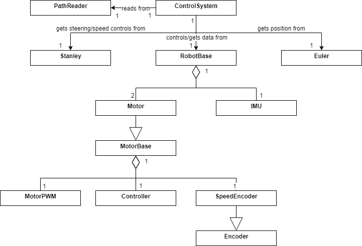

# DRC2019-Embedded-Software
This repository contains the path tracking code developed for the Arduino Mega using C++. This was used by my team's robot in the 2019 QUT Droid Racing Challenge. The Arduino Mega accepts (x, y) coordinates via serial and controls the robot to follow the supplied path. This robot uses differential steering to drive and takes in measurement from encoders and IMU to enable path tracking.

## Project structure
<pre>
--+--main/-+--src/-- .cpp and .hpp files
  |        |
  |        |
  |        |
  |        +-- .ino files
  |
  +-lib/   -- Arduino libraries
 </pre>

## UML Class Diagram

  

## Robot trial run video

## Team Robot

  

